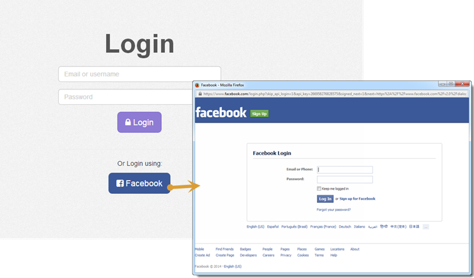

## AngularJS Auth Facebook Login Directive

 * Inserts a login with facebook button.
 * Adds functionality for social network authentication via a popup window.

## Notes:
 * Template uses Bootstrap 3 markup with Font Awesome.
 * This is just the front-end functionality not the authentication (this is handled back-end with Laravel using Facebook Auth 2.0 PHP SDK).
 * It's for use with AngularJS SPA apps as the popup handles the redirecting to the social auth and logging the user in back-end, when finished it simply closes the popup and attempts the login (with the back-end already logged in it just passes the data to the front-end).

## Coming Soon:
 * Blog post on how to use it on http://angularjs4u.com.
 * Sample application and demo.
